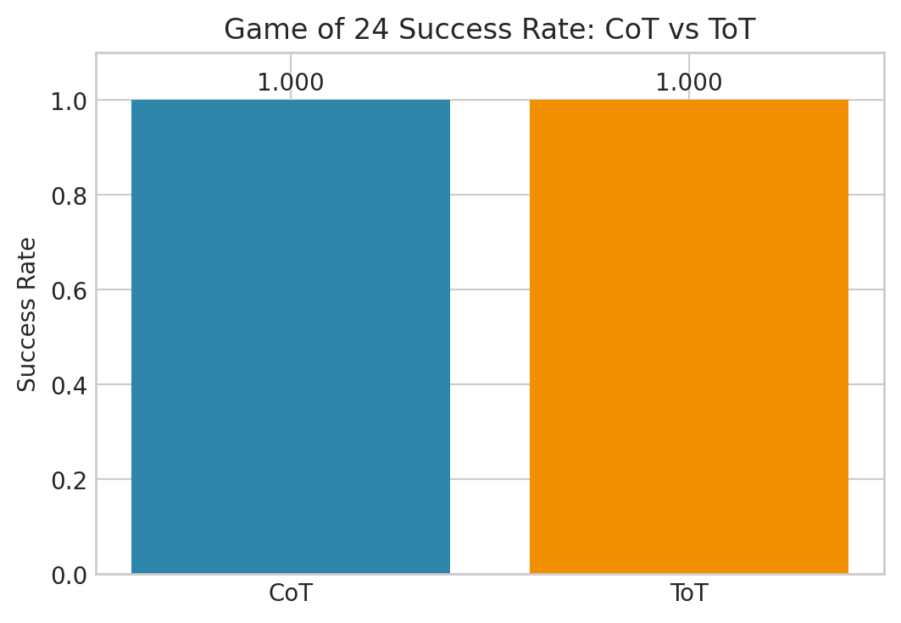
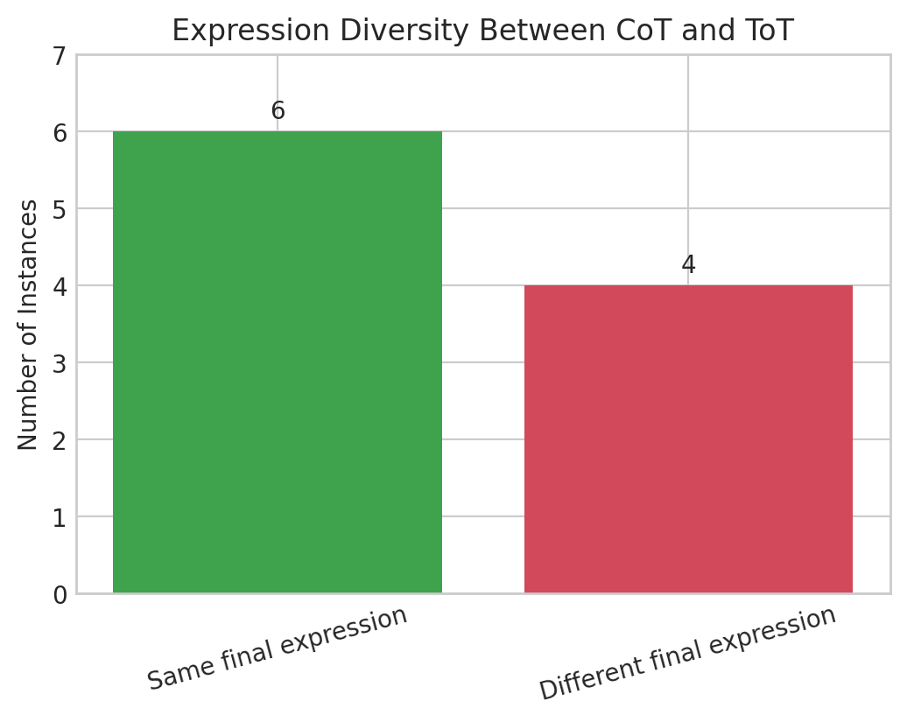

# PA2 Report (Game of 24: CoT vs ToT)

## 1. 과제 개요

본 과제의 목표는 Game of 24 문제를 대상으로 다음 3가지를 구현하고 비교하는 것이다.

- Verifier: 최종 수식의 유효성 판정
- CoT baseline: 단일 reasoning path 기반 풀이
- ToT solver: intermediate state를 유지하며 탐색하는 풀이

평가 기준은 과제 가이드와 동일하게 `success rate`(verifier 기준 정답률)로 설정했다.

## 2. 실행 환경 및 재현 설정

- 구현 파일: `assignment2/PA2.ipynb`
- 데이터셋: notebook 내 `DATASET_24` (10문항)
- 기본 모델 설정: `OPENAI_MODEL = "gpt-4"`
- API 키 설정: `OPENAI_API_KEY` 환경변수 사용
- 난수 고정: `SEED = 7` (`random`, `numpy`)
- 온도: `temperature = 0.0`
- 제출 실행성 확인: `jupyter nbconvert --execute assignment2/PA2.ipynb`
- 모델 제약: 자체 reasoning 모델(예: GPT-o1 계열) 미사용

실행에 사용한 주요 의존성:

- `numpy`, `pandas`, `sympy`, `openai`, `jupyter`, `ipykernel`, `huggingface_hub`, `reasoning-from-scratch`

## 3. Verifier 설계 및 구현

### 3.1 설계 목표

Verifier는 아래 3조건을 분리 판정하도록 구현했다.

- 문법 유효성(`valid_syntax`)
- 숫자 사용 규칙 충족(`used_numbers_ok`)
- 값이 정확히 24인지(`value_ok`)

최종 성공은 `success = valid_syntax and used_numbers_ok and value_ok`.

### 3.2 구현 방식

- 문자열 정규화: `×, ÷, −`를 ASCII 연산자로 변환
- 안전 파싱: `ast.parse(..., mode="eval")`
- 허용 노드 화이트리스트:
  - 허용: `Expression`, `BinOp`, `UnaryOp`, `Constant`, `Add/Sub/Mult/Div`, `UAdd/USub`
  - 금지: `Call`, `Name`, `Pow`, `FloorDiv`, `Mod` 등
- 숫자 사용 검사: AST literal 추출 후 입력 숫자 멀티셋과 정확히 일치하는지 확인
- 안전 평가: AST를 재귀 평가하여 `Fraction`으로 계산(부동소수 오차 회피)
- 예외 처리: syntax error, division by zero 등은 `error` 필드에 기록

### 3.3 Verifier 동작 확인(샘플 테스트)

| 케이스 | 입력 수식 | numbers | 핵심 결과 |
|---|---|---|---|
| valid | `(10-4)*(13-9)` | `[4,9,10,13]` | `success=True` |
| wrong_number | `(10-4)*(13-8)` | `[4,9,10,13]` | `used_numbers_ok=False`, `value=30.0` |
| syntax_error | `(10-4)*(13-9` | `[4,9,10,13]` | `valid_syntax=False` |
| div_zero | `10/(9-9)+4+13` | `[4,9,10,13]` | `evaluation error: division by zero` |
| disallowed_pow | `(10-4)**2` | `[4,9,10,13]` | `disallowed AST node: Pow` |

## 4. CoT Baseline 설계 및 결과

### 4.1 설계

문항별 파이프라인:

1. `make_cot_prompt(numbers)`로 프롬프트 생성
2. LLM 1회 호출
3. 응답에서 최종 수식 추출(`EXPR:` 우선, fallback regex)
4. `verify_24_expression`으로 정답 판정

반환 DataFrame 주요 컬럼:

- `id`, `numbers`, `raw_response`, `extracted_expr`, `success`

### 4.2 결과

- 총 10문항 중 10문항 성공
- `success rate = 1.000`

## 5. ToT Solver 설계 및 결과

### 5.1 State representation 및 탐색 전략

상태는 `NodeState(items, steps)`로 정의했다.

- `items`: 현재 남은 값과 부분식(`Item(value: Fraction, expr: str)`) 튜플
- `steps`: intermediate equation trace

탐색 절차:

1. 초기 beam 생성
2. 각 상태에서 연산 후보를 확장(`+,-,*,/`)
3. heuristic score 계산(24와 거리 기반)
4. (선택) LLM propose/value 정보를 bonus로 반영
5. 상위 `beam_width` 상태만 유지
6. terminal(`len(items)==1 and value==24`)이면 종료 후 최종 식 검증

요구사항의 핵심인 `state -> thought -> next state` 전이를 유지하는 구조다.

### 5.2 결과

- 설정: `beam_width=5`
- 총 10문항 중 10문항 성공
- `success rate = 1.000`

## 6. CoT vs ToT 비교 결과

요약:

- CoT: `10/10 = 1.000`
- ToT: `10/10 = 1.000`
- `delta (ToT - CoT) = 0.000`
- `improved_by_tot = 0/10`

보고서 삽입용 그래프:

인스턴스별 결과:

| id | numbers | baseline_expr | baseline_success | tot_expr | tot_success | improved_by_tot |
|---|---|---|---|---|---|---|
| easy_01 | [4, 9, 10, 13] | `((4-10)*(9-13))` | True | `((4-10)*(9-13))` | True | False |
| easy_02 | [2, 3, 4, 12] | `(12*((2*3)-4))` | True | `((2*12)*(4-3))` | True | False |
| easy_03 | [1, 3, 8, 8] | `((8*(1+3))-8)` | True | `((8*(1+3))-8)` | True | False |
| medium_01 | [3, 3, 8, 8] | `(8/(3-(8/3)))` | True | `(8/(3-(8/3)))` | True | False |
| medium_02 | [1, 5, 5, 5] | `(5*(5-(1/5)))` | True | `(5*(5-(1/5)))` | True | False |
| medium_03 | [2, 7, 7, 12] | `(12*((2+7)-7))` | True | `((2*12)+(7-7))` | True | False |
| medium_04 | [1, 2, 6, 6] | `(6+(6*(1+2)))` | True | `(1*(2*(6+6)))` | True | False |
| hard_01 | [5, 5, 5, 9] | `((5+5)+(5+9))` | True | `((5+5)+(5+9))` | True | False |
| hard_02 | [1, 4, 6, 6] | `((6*(1+4))-6)` | True | `((6*(1+4))-6)` | True | False |
| hard_03 | [1, 1, 11, 11] | `((1+1)+(11+11))` | True | `(1+(1+(11+11)))` | True | False |

해석:

- 본 데이터셋에서는 CoT도 이미 100% 성공하므로 ToT의 정답률 이득은 관찰되지 않았다.
- 다만 ToT는 explicit state/trace를 남기므로, 더 어려운 분포에서 디버깅과 실패 원인 분석에 유리하다.

## 7. Failure Case Analysis

### 7.1 관측된 실패

- `DATASET_24` 기준 CoT/ToT 모두 실패 케이스가 발생하지 않았다.

### 7.2 잠재 실패 유형과 대응

- F1 (extraction failure): 출력 포맷 불안정
  - 대응: `EXPR:` 우선 파싱 + 라인 기반 fallback + normalize
- F2 (syntax invalid): 괄호 불일치, 금지 연산자 사용
  - 대응: AST whitelist 검증
- F3 (wrong number usage): 숫자 누락/중복
  - 대응: literal multiset exact match
- F4 (value != 24): 계산 결과 오차/오답
  - 대응: `Fraction` exact evaluation
- F5 (search/pruning failure): ToT에서 유망 경로 소실
  - 대응: beam width 조정, value bonus 완화, 중복 상태 처리 점검

## 8. 과제 요구사항 충족 여부 체크

- Verifier 구현: 완료
- CoT baseline 구현: 완료
- ToT solver 구현(상태/확장/평가/탐색/재구성): 완료
- CoT/ToT 비교 실험: 완료
- 보고서 필수 항목 5개: 본 문서에 모두 포함

## 9. 제출물 안내

과제 가이드 기준 제출물은 아래 2개다.

- `PA2.ipynb`
- `[student number].pdf`

현재 문서(`PA2_report.md`)는 PDF 보고서 작성용 원본으로 사용 가능하다.  
최종 제출 전에는 학번 파일명 규칙(`[student number].pdf`)으로 변환해 제출해야 한다.
